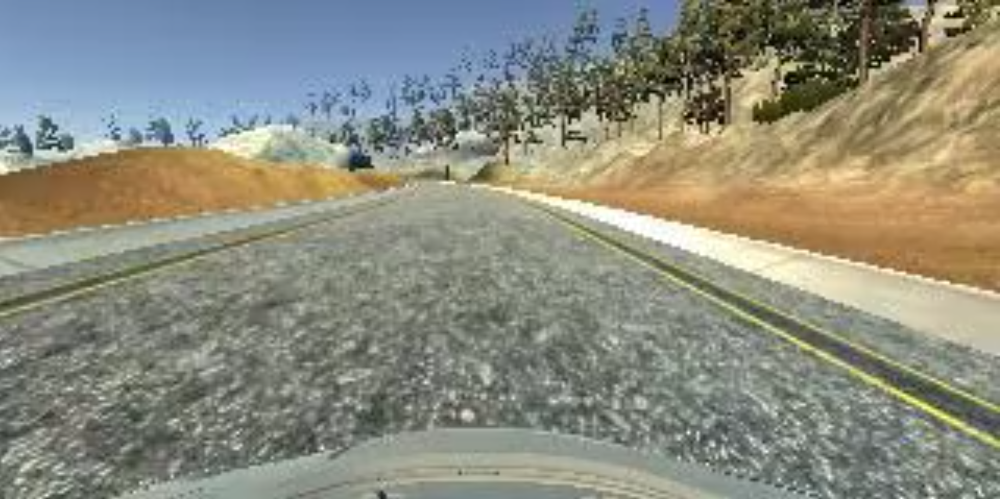

# **Udacity SDCND term1 project3: Behavior Cloning** 

## 1. Overall strategy

---

The driver behavior cloning project applies the following key steps:

(1) Data preparation:
    - Collect more training data using simulator
    - Apply data augmentation to enrich the training set
(2) Regression network design:
    - Use compact network to reduce overfitting (model of 100K parameters, of size 1.35MB)
    - Use fully-convolutional network to reduce loss of spatial information caused by flattening
    - Reduce regularization force to balance smooth driving and prediction accuracy
(3) Model training:
    - Feed data using generator and apply data augmentation during training
    - Use callbacks to apply learning rate schedular and save regularly check points
(4) Training process summary:
    - Inspect training process by plotting loss/acc curve
    - Generate video to show driving performance
    
[//]: # (Image References)
[track1_sample]:./track1_sample.png "track 1 screenshot"
[track2_sample]:./track2_sample.png "track 2 screenshot"

---

## 2. Data Preparation

### 2.1 Collect more data

The downloaded training samples are sufficient to finish the track one, but collecting more data improves the prediction accuracy. In this execise, around 8k frames of data are collected. 

### 2.2 Data augmentation

Both central image and the left/right images are used during training. The correction angle for left and right images is computed adaptively using the standard deviation of steering angle data. In this execise, the value to use is 0.1030.

---
## 3 Network Design

### Data preprocessing

Sky and car hood are cropped out before feeding image to convolutional network feature extraction. They are not supposed to be relevant for steering wheel decision. For example, passing under a bridge may change the upper section of the image, but it is not relevant to steering angle changes.

Input images are whitened through a normalization step.

### Use fully-convolutional network

A 3-layer CNN is used for feature extraction, and no deeper model is adopted to reduce the risk of overfitting. In order to avoid losing spatial information after feature extraction, the flatterning is replaced by convolution to keep better spatial correlation while reducing dimensionality.

### Compensate data by striding and padding

Due to the nature of the recorded image, whose depth (vertical axis) is compressed much higher than breadth (horizental axis), especially after cropping out the sky and car hood, therefore, twice stride is applied on horizental axis (as opposed to vertical axis) at the first convolutional layer to compensate the image aspect ratio.

Zero padding is used at other convolutional layers to avoid losing overscan area too quickly.

### Model layout

The table below shows the layout of the model.

|     Index      |           Layer    		|        Purpose    	    | Activation Dimension  |
|:--------------:|:------------------------:|:-------------------------:|:---------------------:|
|                |   Input(after cropping)  |    Remove sky and hood    |     75 x 320  x  3    |
|       1        |   Conv/BatchNorm/Pool    |    Edge extraction        |     17 x  39  x 24    |
|       2        |   Conv/BatchNorm/Pool    |    Landmarker extraction  |      8 x  19  x 32    |
|       3  		 |	 Conv/BatchNorm/Pool    |    Shape descriptor    	|      3 x   9  x 48    |
|       4        |       Conv/Dropout       |       Flatterning         |      1 x   1  x 64    |
|       4        |          Conv            |    Info. boiling down     |      1 x   1  x 16    |
|       5        |       Conv/Reshape       |        Prediction         |      1                |

Dropout and convolution kernel regularizer are still applied for the purspose of smoother driving performance, but in order to maintain prediction accuracy, the ratio of dropout is set to be 10%, and kernel regularizer parameter is set to be 0.001.

---
## 4 Training model

Adam optimizer is used with initial learning rate of 0.01. A linear learning rate schedular is applied through callbacks. In this execise, the model is trained over 100 epochs with a learning rate decay step every 20 epochs.

At each epoch, a check point file is generated, and the model which minimizes validation loss will be used as the trained model.

### 4.1 Layer-wise layout

Detailed layer-wise layout is shown below:

|         Layer (type)      |      Output Shape        |         Param #       |
|:-------------------------:|:------------------------:|:---------------------:|
| cropping2d_1 (Cropping2D) | (None, 75, 320, 3)       | 0                     |
|lambda_1 (Lambda)          | (None, 75, 320, 3)       | 0                     |
|conv2d_1 (Conv2D)          | (None, 36, 79, 24)       | 1824                  |
|batch_normalization_1      | (None, 36, 79, 24)       | 96                    |
|relu_1 (Activation)        | (None, 36, 79, 24)       | 0                     |
|pool_1 (MaxPooling2D)      | (None, 17, 39, 24)       | 0                     |
|conv2d_2 (Conv2D)          | (None, 17, 39, 32)       | 6944                  |
|batch_normalization_2      | (None, 17, 39, 32)       | 128                   |
|relu_2 (Activation)        | (None, 17, 39, 32)       | 0                     |
|pool_2 (MaxPooling2D)      | (None, 8, 19, 32)        | 0                     |
|conv2d_3 (Conv2D)          | (None, 8, 19, 48)        | 13872                 |
|batch_normalization_3      | (None, 8, 19, 48)        | 192                   |
|relu_3 (Activation)        | (None, 8, 19, 48)        | 0                     |
|pool_3 (MaxPooling2D)      | (None, 3, 9, 48)         | 0                     |
|conv2d_4 (Conv2D)          | (None, 1, 1, 64)         | 83008                 |
|batch_normalization_4      | (None, 1, 1, 64)         | 256                   |
|relu_4 (Activation)        | (None, 1, 1, 64)         | 0                     |
|dropout_4 (Dropout)        | (None, 1, 1, 64)         | 0                     |
|conv2d_5 (Conv2D)          | (None, 1, 1, 16)         | 1040                  |
|batch_normalization_5      | (None, 1, 1, 16)         | 64                    |
|relu_6 (Activation)        |  (None, 1, 1, 16)        |  0                    |
|conv2d_6 (Conv2D)          |  (None, 1, 1, 1)         |  17                   |
|reshape_1 (Reshape)        |  (None, 1)               |  0                    |
Total params: 107,441. Trainable params: 107,073. Non-trainable params: 368

### 4.2 Training log

Part of the training log is attached below:
_________________________________________________________________
Epoch 1/100

Epoch 00001: LearningRateScheduler reducing learning rate to 0.01.
100/100 [==============================] - 215s 2s/step - loss: 2.4488 - val_loss: 0.5591
Epoch 2/100

Epoch 00002: LearningRateScheduler reducing learning rate to 0.01.
100/100 [==============================] - 202s 2s/step - loss: 0.3926 - val_loss: 0.2542
Epoch 3/100

Epoch 00003: LearningRateScheduler reducing learning rate to 0.01.
100/100 [==============================] - 194s 2s/step - loss: 0.2685 - val_loss: 0.2249
Epoch 4/100

... ...

Epoch 00098: LearningRateScheduler reducing learning rate to 1e-06.
100/100 [==============================] - 214s 2s/step - loss: 0.0071 - val_loss: 0.0042
Epoch 99/100

Epoch 00099: LearningRateScheduler reducing learning rate to 1e-06.
100/100 [==============================] - 216s 2s/step - loss: 0.0072 - val_loss: 0.0042
Epoch 100/100

Epoch 00100: LearningRateScheduler reducing learning rate to 1e-06.
100/100 [==============================] - 217s 2s/step - loss: 0.0072 - val_loss: 0.0042

---

## 5. Training process summary

### 5.1 Visualize the training process

The training history of each epoch is collected, and train/validatioin loss are show in figure below:
[train_process]:./train_process.png "training process"
![alt text][train_process]

As can be seen from the figure, at learning rate 0.01, the loss dropped rapidly at the beginning, and flucturated until learning rate is reduced to 0.001 at epoch 20. At the end of 100 epochs, the obtained validation loss is around 0.004.

### 5.2 Video record

The video below shows a recording of automatic driving on track number one:

[//]:

